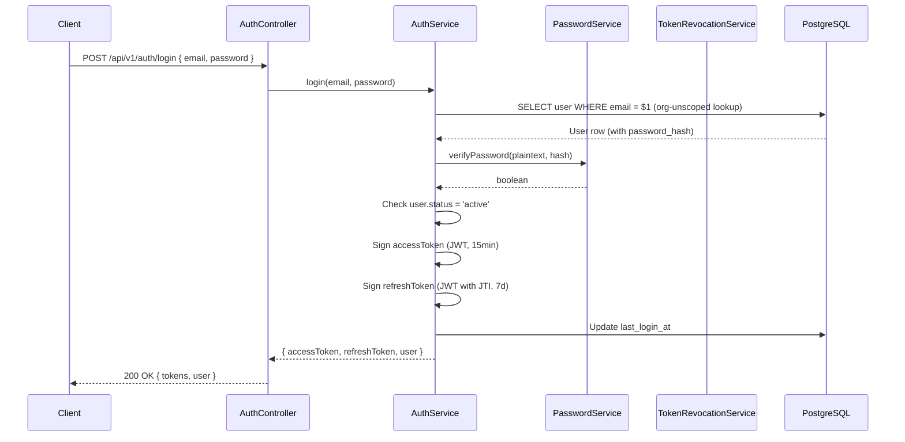

# TriMonarch ERP — Authentication Architecture

## Overview

Authentication is implemented using **JSON Web Tokens (JWT)** with two-token rotation (access + refresh). Passwords are hashed with **bcrypt**. Token revocation uses a database-backed JTI revocation list.

---

## Authentication Flow



---

## JWT Token Structure

### Access Token

```json
{
  "sub": "<userId>",
  "organizationId": "<orgId>",
  "role": "admin",
  "iat": 1234567890,
  "exp": 1234568790
}
```

| Claim | Purpose |
|-------|---------|
| `sub` | User ID |
| `organizationId` | Tenant context |
| `role` | RBAC role |
| `iat` | Issued at |
| `exp` | Expiry (15 minutes) |

### Refresh Token

```json
{
  "sub": "<userId>",
  "jti": "<uniqueJTI>",
  "iat": 1234567890,
  "exp": 1234913890
}
```

| Claim | Purpose |
|-------|---------|
| `sub` | User ID |
| `jti` | Unique token ID for revocation lookup |
| `exp` | Expiry (7 days) |

---

## Token Rotation

On refresh:
1. Client sends `POST /api/v1/auth/refresh { refreshToken }`
2. Server verifies the refresh token signature and expiry
3. Server checks the JTI is not in `auth_token_revocations`
4. Server issues a new access token AND new refresh token
5. Old refresh token JTI is inserted into `auth_token_revocations`

---

## Token Revocation

Revoked tokens are stored in `auth_token_revocations`:

```sql
CREATE TABLE auth_token_revocations (
  jti VARCHAR(255) PRIMARY KEY,
  user_id UUID NOT NULL REFERENCES users(id) ON DELETE CASCADE,
  expires_at TIMESTAMPTZ NOT NULL,
  revoked_at TIMESTAMPTZ NOT NULL DEFAULT CURRENT_TIMESTAMP
);
```

On every request, the `requireAuth` middleware checks if the access token's JTI (or the refresh token's JTI on refresh) is in this table.

Expired entries are periodically cleaned up via the `expires_at` index.

---

## Authentication Middleware

Located at: `src/middleware/auth.ts`

```typescript
export const requireAuth: RequestHandler = async (req, res, next) => {
  // 1. Extract Bearer token from Authorization header
  // 2. Verify JWT signature (rejects tampered tokens)
  // 3. Check expiry (rejects expired tokens)
  // 4. Check JTI against revocation list
  // 5. Attach req.user = { id, organizationId, role, ... }
  // 6. Call next() or return 401
};
```

---

## Authentication Errors

| Error | HTTP Code | Error Code |
|-------|-----------|-----------|
| Missing token | 401 | `UNAUTHORIZED` |
| Expired token | 401 | `TOKEN_EXPIRED` |
| Invalid signature | 401 | `INVALID_TOKEN` |
| Revoked token | 401 | `TOKEN_REVOKED` |
| Inactive account | 401 | `ACCOUNT_INACTIVE` |
| Wrong credentials | 401 | `INVALID_CREDENTIALS` |

---

## Password Security

- bcrypt with cost factor 12
- `password_hash` column is `VARCHAR(255)` (bcrypt output)
- Plain-text passwords are **never logged or returned**
- `password_changed_at` tracks password rotation
- `last_login_at` tracks last successful authentication

---

## Relevant Files

| File | Purpose |
|------|---------|
| `src/middleware/auth.ts` | `requireAuth` middleware |
| `src/services/auth.service.ts` | Login, refresh, logout logic |
| `src/services/tokenRevocation.service.ts` | JTI revocation management |
| `src/services/password.service.ts` | Bcrypt operations |
| `src/utils/jwt.ts` | JWT sign/verify wrappers |
| `src/controllers/auth.controller.ts` | HTTP handlers |
| `src/routes/auth.routes.ts` | `/api/v1/auth/*` routing |
