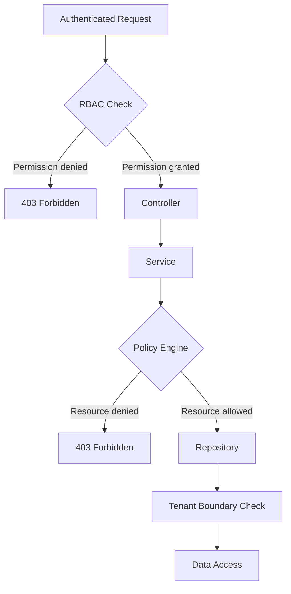

# TriMonarch ERP — Authorization & RBAC Architecture

## Overview

Authorization uses a two-layer model:
1. **RBAC (Role-Based Access Control)** — coarse-grained permission enforcement at the route level
2. **Policy Engine** — fine-grained resource-level authorization at the service level

---

## Authorization Flow



---

## RBAC Roles

| Role | Code | Description |
|------|------|-------------|
| Super Admin | `super_admin` | Full system access |
| Admin | `admin` | Full org access |
| Manager | `manager` | Operational access |
| User | `user` | Read + own resource write |
| Auditor | `auditor` | Read-only access |

---

## Permission Naming Convention

Permissions follow the pattern: `<resource>:<action>`

| Permission | Example |
|-----------|---------|
| `product:read` | Read product list |
| `product:write` | Create/update products |
| `product:delete` | Delete products |
| `sales_order:confirm` | Confirm a sales order |
| `inventory:adjust` | Adjust stock |
| `audit:read` | Read audit logs |
| `user:admin` | Manage users |

---

## RBAC Middleware

Located at: `src/middleware/rbac.ts`

```typescript
export const requirePermission = (permission: string): RequestHandler =>
  async (req, res, next) => {
    const { role } = req.user!;
    if (!hasPermission(role, permission)) {
      return next(new ForbiddenError('Insufficient permissions'));
    }
    next();
  };
```

Applied in routes:
```typescript
router.post('/products', requireAuth, requirePermission('product:write'), controller.create);
```

---

## Policy Engine

Located at: `src/services/policyEngine.service.ts`

The Policy Engine handles **resource-level** authorization decisions that cannot be resolved from the RBAC role alone. Examples:

- Can User A view User B's profile? (same org only)
- Can Manager delete an active sales order? (depends on order status)
- Can a user modify their own organization record? (ownership check)

```typescript
const decision = await policyEngine.evaluate({
  actor: req.user,
  action: 'sales_order:cancel',
  resource: salesOrder,
});

if (!decision.allowed) {
  throw new ForbiddenError(decision.reason);
}
```

---

## Policy Registry

Located at: `src/policies/policy.registry.ts`

Policies are registered per domain:

| Domain | Policy File |
|--------|------------|
| Users | `user.policy.ts` |
| Products | `product.policy.ts` |
| Partners | `partner.policy.ts` |
| Inventory | `inventory.policy.ts` |
| Sales Orders | `salesOrder.policy.ts` |
| Purchase Orders | `purchaseOrder.policy.ts` |
| BOMs | `bom.policy.ts` |
| Manufacturing | `manufacturingOrder.policy.ts` |
| Audit Logs | `audit.policy.ts` |
| Employees | `employee.policy.ts` |
| Organizations | `organization.policy.ts` |

---

## IDOR / BOLA Protection

Every resource access includes a tenant boundary check in the repository:

```sql
SELECT * FROM products WHERE organization_id = $1 AND id = $2
```

If the resource does not belong to the authenticated organization, the query returns no rows, resulting in a `404 Not Found` — **not** a `403 Forbidden` (to prevent resource enumeration).

---

## Privilege Escalation Prevention

- Users cannot assign roles to themselves
- The `super_admin` role can only be assigned by existing super admins
- Role assignment is logged in the audit log
- Users cannot modify their own `role` or `organization_id`

---

## State-Transition Authorization

State transitions (e.g., confirming a sales order) are authorized by policies that consider:

1. The current state of the resource
2. The user's role
3. Business rules (e.g., cannot cancel a completed order)

Invalid transitions return `400 BAD_REQUEST` with a domain-specific error code.
