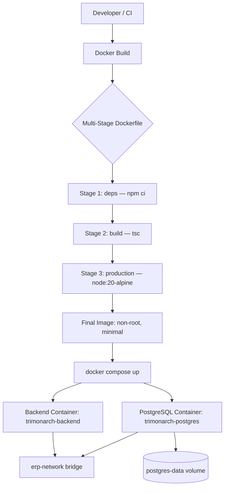

# TriMonarch ERP — Deployment Architecture

## Overview

The backend is containerized using Docker with a multi-stage build for minimal, secure production images. The full environment is orchestrated with Docker Compose for development.

---

## Docker Architecture



---

## Multi-Stage Dockerfile

Located at: `Dockerfile`

```dockerfile
# Stage 1: Install dependencies
FROM node:20-alpine AS deps
WORKDIR /app
COPY package*.json ./
RUN npm ci --only=production

# Stage 2: Build TypeScript
FROM node:20-alpine AS build
WORKDIR /app
COPY package*.json ./
RUN npm ci
COPY . .
RUN npm run build

# Stage 3: Production runtime
FROM node:20-alpine AS production
WORKDIR /app
RUN addgroup -S erp && adduser -S erp -G erp
COPY --from=deps /app/node_modules ./node_modules
COPY --from=build /app/dist ./dist
COPY migrations ./migrations
USER erp
EXPOSE 3000
HEALTHCHECK CMD wget -q -O- http://localhost:3000/health | grep -q '"status"'
CMD ["node", "dist/server.js"]
```

Key properties:
- **Non-root user** (`erp`, UID 1000)
- **Alpine base** (minimal attack surface)
- **No dev dependencies** in final image
- **Health check** via `wget` on `/health`

---

## Docker Compose — Development

Located at: `docker-compose.yml`

```yaml
services:
  backend:
    build: .
    ports:
      - "3000:3000"
    env_file: .env
    depends_on:
      db:
        condition: service_healthy
    networks:
      - trimonarch-network

  db:
    image: postgres:16-alpine
    environment:
      POSTGRES_DB: erp_db
      POSTGRES_USER: erp_user
      POSTGRES_PASSWORD: ${POSTGRES_PASSWORD}
    volumes:
      - postgres-data:/var/lib/postgresql/data
    healthcheck:
      test: ["CMD-SHELL", "pg_isready -U erp_user -d erp_db"]
      interval: 10s
      timeout: 5s
      retries: 5
    networks:
      - trimonarch-network

volumes:
  postgres-data:

networks:
  trimonarch-network:
    driver: bridge
```

---

## Environment Variables

| Variable | Required | Description |
|----------|---------|-------------|
| `DATABASE_URL` | YES | Full PostgreSQL connection string |
| `JWT_SECRET` | YES | Access token signing secret (min 32 chars) |
| `JWT_REFRESH_SECRET` | YES | Refresh token signing secret (min 32 chars) |
| `PORT` | NO | HTTP port (default: `3000`) |
| `NODE_ENV` | YES | `development`, `test`, or `production` |
| `JWT_EXPIRES_IN` | NO | Access token expiry (default: `15m`) |
| `JWT_REFRESH_EXPIRES_IN` | NO | Refresh token expiry (default: `7d`) |
| `RATE_LIMIT_MAX` | NO | Max requests per window (default: `100`) |
| `DATABASE_SSL` | NO | Enable SSL for production database connections |
| `CORS_ORIGIN` | NO | Allowed CORS origins |
| `LOG_LEVEL` | NO | Pino log level (default: `info`) |

---

## Production Configuration

Located at: `src/config/production.ts`

Production safeguards:
- `NODE_ENV=production` is required for production validators to activate
- `JWT_SECRET` must be >= 32 characters (enforced)
- `JWT_REFRESH_SECRET` must be >= 32 characters (enforced)
- `DATABASE_URL` must be a valid URL (enforced at startup)
- Default credentials (e.g., `password123`, `secret`) cause startup failure
- No insecure default values for production-critical settings

---

## Network Architecture

```
                    [Internet]
                         ↓
              [Load Balancer / Reverse Proxy]
                         ↓ :443 (TLS terminated)
                [Backend Container: :3000]
                         ↓ (internal Docker network)
                [PostgreSQL Container: :5432]
                         ↓
                [postgres-data volume]
```

PostgreSQL is bound to the **internal Docker network only** — not accessible from the host in production.

---

## Health Check Integration

Docker Compose uses the health endpoint for dependency management:

```yaml
healthcheck:
  test: ["CMD-SHELL", "wget -q -O- http://localhost:3000/health || exit 1"]
  interval: 30s
  timeout: 10s
  retries: 3
  start_period: 30s
```

The backend container only starts after the database container passes its health check (`pg_isready`).

---

## Graceful Shutdown

On `SIGTERM` (from Docker stop):

1. Express stops accepting new connections
2. Existing requests are allowed to complete
3. PostgreSQL connection pool is drained
4. Process exits cleanly

This ensures zero in-flight request interruption during rolling deploys.
