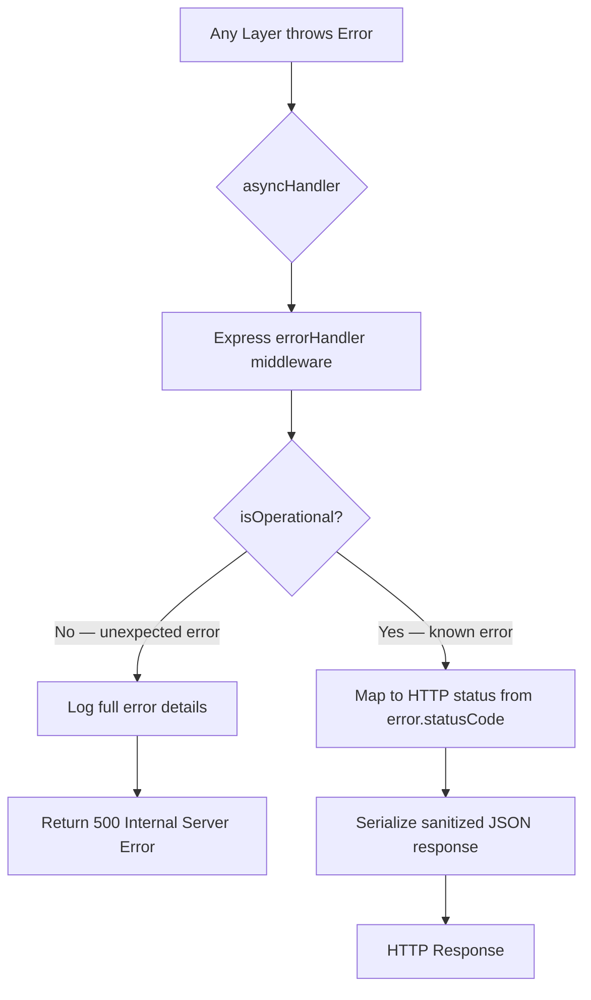

# TriMonarch ERP — Error Handling Architecture

## Overview

All errors flow through the centralized `errorHandler` middleware. Application code throws typed `AppError` subclasses. The middleware maps them to standardized HTTP responses.

---

## Error Class Hierarchy

```
AppError (base)
├── ValidationError       → 422
├── AuthenticationError   → 401
├── ForbiddenError        → 403
├── NotFoundError         → 404
├── ConflictError         → 409
├── DatabaseError         → 500
├── ServiceUnavailableError → 503
└── InternalError         → 500
```

All errors carry:
- `message`: Human-readable description
- `code`: Machine-readable error code (e.g., `INVALID_CREDENTIALS`)
- `statusCode`: HTTP response code
- `isOperational`: `true` for known errors, `false` for unexpected

---

## Error Flow



---

## HTTP Status Code Mapping

| HTTP Code | Meaning | Error Classes |
|-----------|---------|---------------|
| `400 Bad Request` | Malformed request | Bad state transition, invalid enum, malformed body |
| `401 Unauthorized` | Authentication failed | `AuthenticationError`, expired/invalid token |
| `403 Forbidden` | Authorization denied | `ForbiddenError`, RBAC denied, policy denied |
| `404 Not Found` | Resource not found | `NotFoundError`, tenant-scoped lookup miss |
| `409 Conflict` | State conflict | `ConflictError`, deadlock, unique constraint violation |
| `422 Unprocessable Entity` | Validation failed | `ValidationError`, Zod schema rejection |
| `429 Too Many Requests` | Rate limit exceeded | Rate limiter middleware |
| `500 Internal Server Error` | Unexpected error | Uncaught exceptions |
| `503 Service Unavailable` | Service degraded | Database unavailable, health check failure |

---

## Error Response Envelope

```json
{
  "success": false,
  "error": {
    "code": "PRODUCT_NOT_FOUND",
    "message": "Product with the given ID was not found",
    "requestId": "uuid",
    "timestamp": "2025-01-01T00:00:00.000Z"
  }
}
```

Validation errors include field-level details:

```json
{
  "success": false,
  "error": {
    "code": "VALIDATION_ERROR",
    "message": "Input validation failed",
    "fields": {
      "sku": "Required",
      "price": "Must be >= 0"
    }
  }
}
```

---

## PostgreSQL Error Mapping

Located in `src/errors/errorMapper.ts`:

| PG Error Code | Meaning | App Error |
|--------------|---------|-----------|
| `23505` | Unique constraint violation | `ConflictError` |
| `23503` | Foreign key violation | `ConflictError` |
| `23502` | NOT NULL violation | `ValidationError` |
| `23514` | Check constraint violation | `ValidationError` |
| `40001` | Serialization failure | `ConflictError (SERIALIZATION_FAILURE)` |
| `40P01` | Deadlock detected | `ConflictError (DEADLOCK_DETECTED)` |
| `42P01` | Undefined table | `InternalError` |

---

## Stack Trace Protection

In production (`NODE_ENV=production`):
- Stack traces are **never** included in API responses
- Internal error messages are sanitized
- PostgreSQL error details are logged server-side only
- Only the `code` and a safe `message` are returned to clients

---

## Error Codes Reference

| Code | HTTP | Description |
|------|------|-------------|
| `UNAUTHORIZED` | 401 | Missing or invalid authentication |
| `TOKEN_EXPIRED` | 401 | JWT access token has expired |
| `TOKEN_REVOKED` | 401 | JWT has been revoked |
| `INVALID_CREDENTIALS` | 401 | Wrong email/password |
| `FORBIDDEN` | 403 | Insufficient permissions |
| `NOT_FOUND` | 404 | Resource does not exist |
| `VALIDATION_ERROR` | 422 | Input validation failed |
| `CONFLICT` | 409 | Unique constraint or state conflict |
| `RATE_LIMITED` | 429 | Too many requests |
| `INTERNAL_ERROR` | 500 | Unexpected server error |
| `SERVICE_UNAVAILABLE` | 503 | Dependency unavailable |

---

## `asyncHandler` Wrapper

All Express route handlers are wrapped with `asyncHandler` to catch unhandled promise rejections:

```typescript
export const asyncHandler =
  (fn: RequestHandler): RequestHandler =>
  (req, res, next) => {
    Promise.resolve(fn(req, res, next)).catch(next);
  };
```

This ensures async errors propagate to the centralized error handler.
