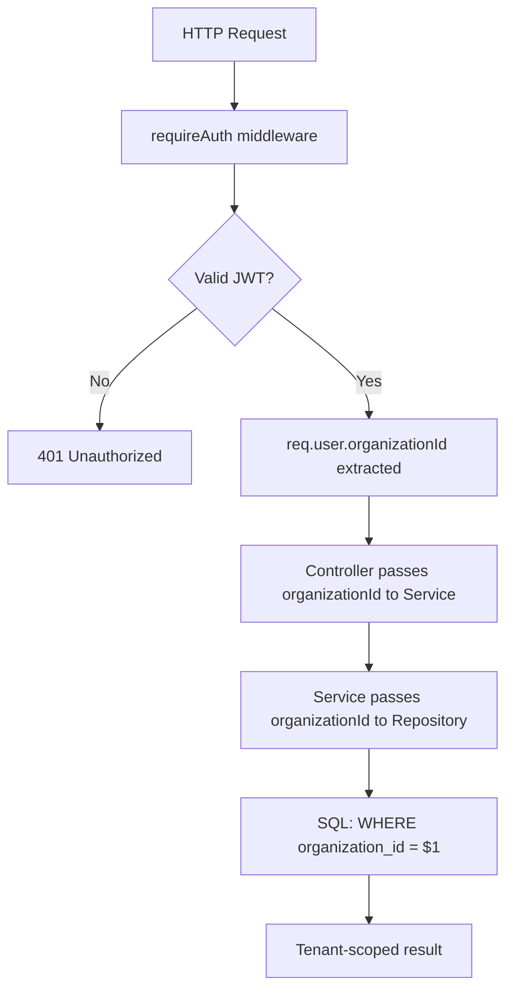

# TriMonarch ERP — Multi-Tenancy Architecture

## Strategy: Row-Level Tenancy with Shared Schema

Every organization's data co-exists in the same PostgreSQL schema. Isolation is enforced at multiple layers to prevent cross-tenant data access.

---

## Tenant Isolation Flow



---

## Organization Context Injection

The JWT payload carries the `organizationId` claim:

```json
{ "sub": "user-uuid", "organizationId": "org-uuid", "role": "admin" }
```

The `requireAuth` middleware extracts this and attaches it to `req.user`:

```typescript
req.user = {
  id: payload.sub,
  organizationId: payload.organizationId,
  role: payload.role,
};
```

Controllers extract `organizationId` **only from `req.user`**, never from request parameters:

```typescript
// CORRECT
const { organizationId } = req.user!;

// WRONG — allows cross-tenant override
const { organizationId } = req.query;
```

---

## Cross-Tenant Override Prevention

If a client sends `organizationId` in query parameters that differs from the JWT claim:

```
GET /api/v1/products?organizationId=<other-org-uuid>
```

The backend detects the mismatch and returns:

```json
{ "error": "Cross-organization access denied" }
```

HTTP `400 BAD_REQUEST` is returned (not 403, to avoid confirming org existence).

---

## Repository Tenant Enforcement

Every repository method that accesses tenant-owned data includes `organization_id` as the first parameter:

```typescript
async findAll(organizationId: string, filters: Filters): Promise<Product[]> {
  const result = await this.pool.query(
    'SELECT * FROM products WHERE organization_id = $1 ...',
    [organizationId, ...]
  );
  return result.rows;
}
```

---

## Tenant-Scoped Unique Constraints

Domain uniqueness is always tenant-scoped:

| Table | Unique Scope |
|-------|-------------|
| `users.email` | Per organization |
| `products.sku` | Per organization |
| `warehouses.code` | Per organization |
| `sales_orders.order_number` | Per organization |
| `purchase_orders.order_number` | Per organization |
| `boms.bom_code` | Per organization |
| `manufacturing_orders.order_number` | Per organization |

---

## Tables Without Tenant Ownership

| Table | Reason |
|-------|--------|
| `organizations` | IS the tenant root |
| `auth_token_revocations` | Scoped via `user_id` which implies tenant |
| `schema_migrations` | System table |

---

## Audit Log Tenant Scoping

All audit records carry `organization_id`:

```sql
INSERT INTO audit_logs (organization_id, user_id, action, entity_type, ...)
VALUES ($1, $2, $3, $4, ...)
```

Audit API queries always filter by `organization_id`:

```sql
SELECT * FROM audit_logs WHERE organization_id = $1 ORDER BY created_at DESC
```

---

## Business Event Tenant Scoping

All business events carry `organization_id`:

```typescript
await businessEventService.emit(organizationId, {
  eventType: 'SALES_ORDER_CONFIRMED',
  aggregateId: order.id,
  payload: { ... }
});
```

---

## Tenant Isolation Index Strategy

All high-frequency indexes include `organization_id` as the leading column:

```sql
CREATE INDEX idx_products_org ON products(organization_id);
CREATE INDEX idx_products_org_sku ON products(organization_id, sku);
```

This enables PostgreSQL to efficiently filter per-tenant results without full table scans.
