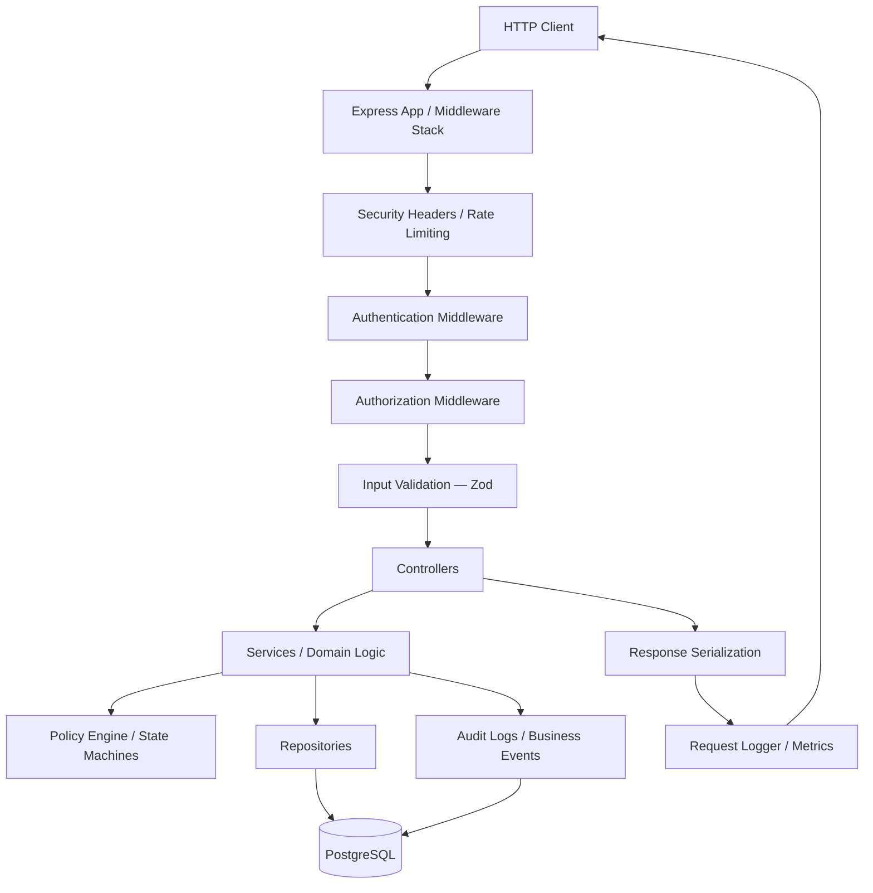

# TriMonarch ERP — System Architecture Overview

## Overview

TriMonarch ERP is a production-grade, multi-tenant Enterprise Resource Planning backend built on Node.js, TypeScript, Express, and PostgreSQL. It follows a strict layered architecture with clear separation between HTTP concerns, business logic, and data access.

---

## Architecture Diagram



---

## Architectural Layers

```
┌────────────────────────────────────────────────────┐
│                   HTTP / REST API                  │
├────────────────────────────────────────────────────┤
│              Middleware (Security, Auth)            │
├────────────────────────────────────────────────────┤
│                    Controllers                     │
├────────────────────────────────────────────────────┤
│            Services (Business Logic)               │
├────────────────────────────────────────────────────┤
│        Policies / State Machines / Engines         │
├────────────────────────────────────────────────────┤
│              Repositories (Data Access)            │
├────────────────────────────────────────────────────┤
│                    PostgreSQL 16                   │
└────────────────────────────────────────────────────┘
```

---

## Layer Responsibilities

| Layer | Responsibility |
|-------|---------------|
| **HTTP / REST** | Accept/reject requests, route to controllers |
| **Middleware** | Auth, rate limiting, request IDs, CORS, security headers |
| **Controllers** | Parse input, call services, serialize response |
| **Services** | Business rules, domain workflows, coordination |
| **Policies** | Authorization decisions on domain resources |
| **State Machines** | Enforce valid state transitions |
| **Repositories** | SQL queries, tenant scoping, record mapping |
| **PostgreSQL** | Persistence, constraints, transactions |

---

## Request Lifecycle Summary

```
Request → Middleware Stack → Controller → Service → Repository → DB → Response
```

Full lifecycle: see [request-lifecycle.md](./request-lifecycle.md)

---

## Module Architecture

The backend is organized around ERP domains. Each domain owns its:

- Controller (`*.controller.ts`)
- Service (`*.service.ts`)
- Repository (`*.repository.ts`)
- Validation Schemas (`*.schema.ts`)
- Policy (`*.policy.ts`)
- Routes (`*.routes.ts`)

---

## Key Architectural Principles

### 1. Tenant Isolation by Default
Every query against a tenant-owned table MUST include `WHERE organization_id = $1`. This is enforced at the repository layer. See [multi-tenancy.md](./multi-tenancy.md).

### 2. Parameterized SQL Only
No string interpolation in any SQL query. All values pass through the `pg` parameterized query interface.

### 3. Explicit Transaction Ownership
All multi-step mutations (inventory updates, order confirmations, manufacturing execution) are wrapped in explicit `BEGIN / COMMIT / ROLLBACK` transactions at the service layer.

### 4. Append-Only Audit
Every mutation produces an `audit_logs` record within the same transaction. Audit records are protected by database triggers that prevent UPDATE or DELETE.

### 5. Zod Validation at the Boundary
All external inputs (request body, query parameters, path parameters) are validated by Zod schemas in the middleware/controller layer before reaching any service.

### 6. Security Headers on Every Response
Every response carries HSTS, CSP, X-Frame-Options, X-Content-Type-Options, and other security headers via the `securityHeaders` middleware.

### 7. Structured Observability
Every HTTP request is logged with correlation ID, method, path, status, and duration. Every error is captured with sanitized detail. Metrics are exposed via Prometheus-format `/metrics` endpoint.
