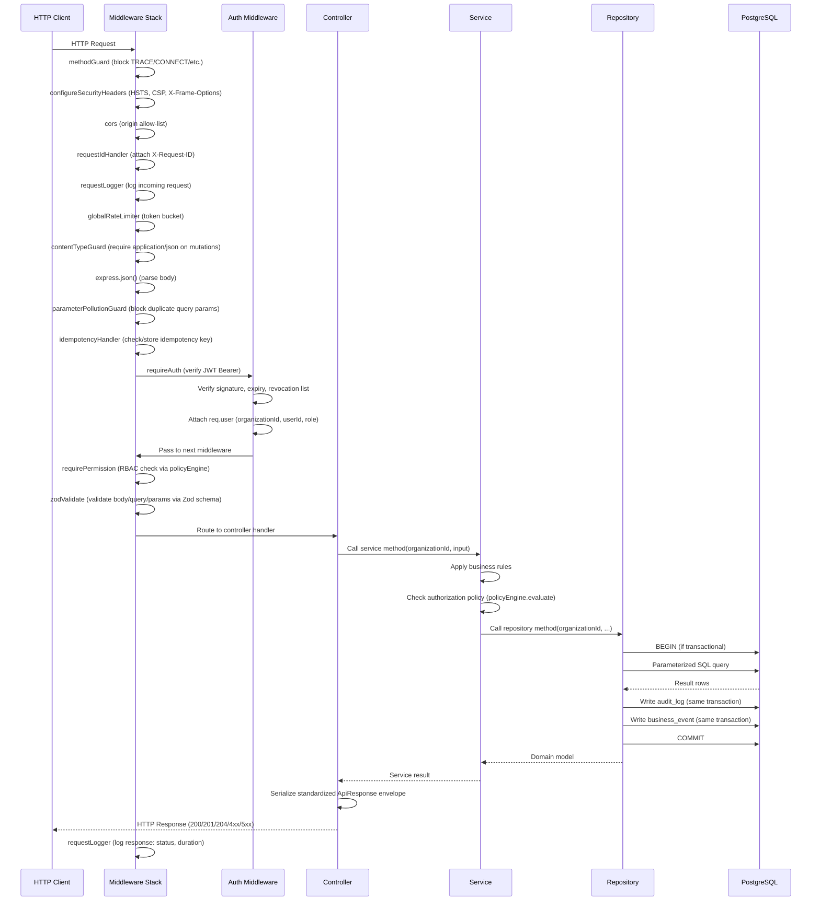

# TriMonarch ERP — HTTP Request Lifecycle

## Complete Request Flow



---

## Middleware Stack Order

The middleware stack in `src/app.ts` applies in this exact order:

| # | Middleware | Purpose |
|---|-----------|---------|
| 1 | `methodGuard` | Block non-standard HTTP methods |
| 2 | `configureSecurityHeaders` | HSTS, CSP, X-Content-Type-Options, X-Frame-Options, Referrer-Policy |
| 3 | `cors` | CORS origin allow-list |
| 4 | `requestIdHandler` | Attach/generate `X-Request-ID` |
| 5 | `requestLogger` | Log incoming request details |
| 6 | `globalRateLimiter` | Token-bucket rate limiting |
| 7 | `contentTypeGuard` | Enforce `Content-Type: application/json` on POST/PUT/PATCH |
| 8 | `express.json()` | Parse JSON body with size limit |
| 9 | `express.urlencoded()` | Parse URL-encoded bodies |
| 10 | `parameterPollutionGuard` | Reject duplicate query parameters |
| 11 | `idempotencyHandler` | Handle idempotency keys (cache duplicate requests) |
| 12 | Health Routes (`/health`, `/health/live`, `/health/ready`, `/ready`) | No auth required |
| 13 | Metrics Route (`/metrics`) | No auth required |
| 14 | Docs Routes (`/openapi.json`, `/api-docs`) | No auth required |
| 15 | `/api/v1` Router | All domain API routes |
| 16 | `notFoundHandler` | 404 for unmatched routes |
| 17 | `errorHandler` | Centralized error response handler |

---

## Authentication Point

Authentication occurs inside domain routes via `requireAuth` middleware:

```typescript
router.get('/products', requireAuth, requirePermission('product:read'), handler);
```

- `requireAuth` verifies the `Authorization: Bearer <token>` header
- Checks token signature and expiry
- Checks the JTI against the revocation list
- Attaches `req.user = { id, organizationId, role, ... }`

---

## Authorization Point

Authorization occurs immediately after authentication:

```typescript
requirePermission('product:write')
```

- Resolves the user's role permissions via the RBAC map
- Delegates complex resource-level checks to the Policy Engine
- Returns `403 Forbidden` on denial before the controller is reached

---

## Validation Point

Validation via Zod occurs before the controller:

```typescript
router.post('/products', requireAuth, zodValidate(createProductSchema), controller.create);
```

- Invalid input returns `422 Unprocessable Entity` with structured field errors
- Strips unknown fields to prevent mass assignment

---

## Transaction Boundary

Transactions are owned by the **service layer** for multi-step operations, or by the **repository layer** for single-step atomic operations:

```typescript
// Service-level transaction
const client = await pool.connect();
await client.query('BEGIN');
// ... multiple repository calls using client
await client.query('COMMIT');
```

---

## Audit Point

Audit records are written **within the same database transaction** as the domain mutation. This prevents:
- Ghost audit entries for failed operations
- Missing audit entries for successful operations

---

## Error Flow

```
Any Layer throws AppError
        ↓
asyncHandler catches it
        ↓
Express errorHandler middleware
        ↓
errorMapper maps to HTTP status + code
        ↓
Sanitized JSON response (no stack traces in production)
        ↓
requestLogger logs error details
```

---

## Response Envelope

All successful responses use the standard API response envelope:

```json
{
  "success": true,
  "data": { ... },
  "meta": {
    "requestId": "uuid",
    "timestamp": "ISO8601",
    "pagination": { "page": 1, "limit": 20, "total": 100 }
  }
}
```
