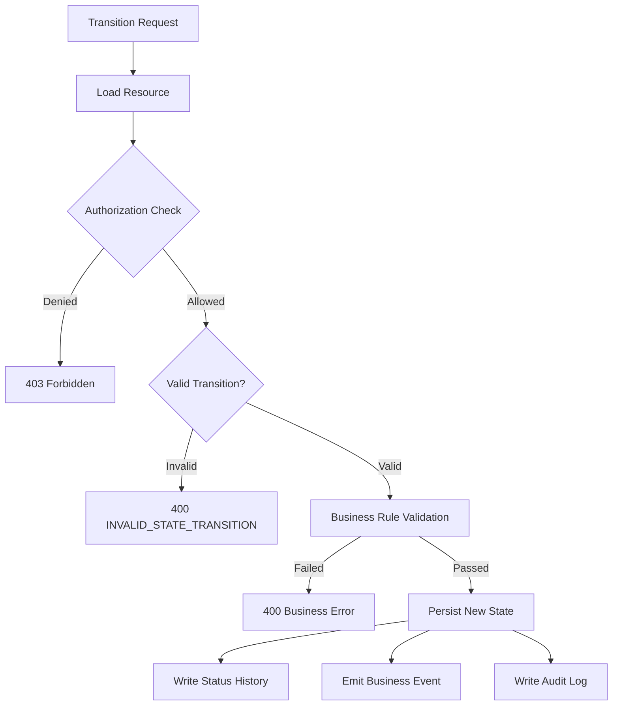

# TriMonarch ERP — State Machine Architecture

## Overview

Stateful domain workflows are enforced by dedicated state machine services. Invalid state transitions return a `400 BAD_REQUEST` with a specific error code.

---

## State Transition Pattern



---

## Sales Order Lifecycle

```
        ┌────────────────────────────────────────┐
        │              draft                     │
        └────────────────┬───────────────────────┘
                         │ confirm
                         ▼
        ┌────────────────────────────────────────┐
        │             confirmed                  │
        └────────────────┬───────────────────────┘
                         │ start processing
                         ▼
        ┌────────────────────────────────────────┐
        │            processing                  │
        └────────────────┬───────────────────────┘
                         │ ship
                         ▼
        ┌────────────────────────────────────────┐
        │             shipped                    │
        └────────────────┬───────────────────────┘
                         │ complete
                         ▼
        ┌────────────────────────────────────────┐
        │            completed                   │
        └────────────────────────────────────────┘

Any state except completed → cancelled (with rules)
```

| Transition | From | To | Authorization |
|-----------|------|----|--------------|
| confirm | draft | confirmed | `sales_order:confirm` |
| process | confirmed | processing | `sales_order:write` |
| ship | processing | shipped | `sales_order:write` |
| complete | shipped | completed | `sales_order:complete` |
| cancel | draft, confirmed | cancelled | `sales_order:cancel` |

**Service**: `src/services/salesOrderStateMachine.service.ts`

---

## Purchase Order Lifecycle

```
draft → submitted → approved → processing → received → completed
                                                    ↗ cancelled (from draft, submitted)
```

| Status | Description |
|--------|-------------|
| `draft` | Initial creation |
| `submitted` | Sent to supplier |
| `approved` | Approved internally |
| `processing` | Fulfillment in progress |
| `received` | Goods received |
| `completed` | Invoiced and paid |
| `cancelled` | Voided |

**Service**: `src/services/purchaseOrderStateMachine.service.ts`

---

## Purchase Receipt Lifecycle

```
draft → posted → cancelled (from draft only)
```

**Service**: `src/services/purchaseReceiptStateMachine.service.ts`

---

## Manufacturing Order Lifecycle

```
draft → planned → released → in_progress → completed
                                         ↘ cancelled (from draft, planned, released)
```

| Status | Description |
|--------|-------------|
| `draft` | Initial creation |
| `planned` | Scheduled |
| `released` | Ready for production |
| `in_progress` | Active production |
| `completed` | Finished |
| `cancelled` | Abandoned |

**Service**: `src/services/manufacturingOrderStateMachine.service.ts`

Status changes are recorded in `manufacturing_order_status_history`.

---

## BOM Lifecycle

```
draft → active → inactive
```

| Status | Description |
|--------|-------------|
| `draft` | Under revision |
| `active` | In use for production |
| `inactive` | Archived |

**Service**: `src/services/bomStateMachine.service.ts`

---

## Supplier Invoice Lifecycle

```
draft → submitted → approved → paid → cancelled
```

**Service**: `src/services/supplierInvoiceStateMachine.service.ts`

---

## Sales Delivery Lifecycle

```
draft → dispatched → delivered → cancelled
```

**Service**: `src/services/salesDeliveryStateMachine.service.ts`

---

## State Machine Service Pattern

All state machine services follow this pattern:

```typescript
async transition(
  organizationId: string,
  resourceId: string,
  targetStatus: string,
  actorId: string
): Promise<Resource> {
  // 1. Load resource with org isolation
  const resource = await repository.findById(organizationId, resourceId);
  if (!resource) throw new NotFoundError(...);

  // 2. Check if transition is valid
  const allowed = VALID_TRANSITIONS[resource.status]?.includes(targetStatus);
  if (!allowed) throw new InvalidStateTransitionError(resource.status, targetStatus);

  // 3. Apply business rules (business constraint checks)
  await this.validateTransition(resource, targetStatus);

  // 4. Persist new state within transaction
  const updated = await repository.updateStatus(organizationId, resourceId, targetStatus, client);

  // 5. Record audit + business event
  await auditService.log({ action: 'STATE_TRANSITION', ... });

  return updated;
}
```
