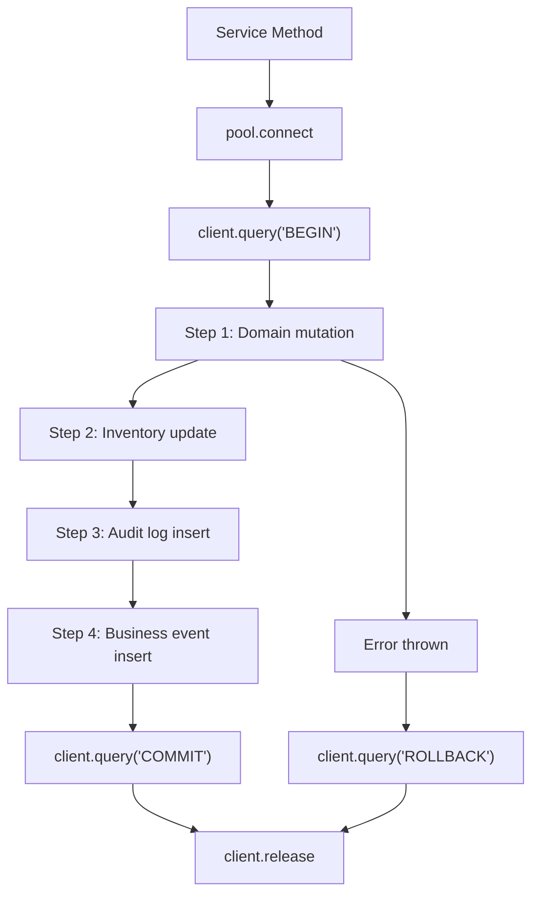

# TriMonarch ERP — Transaction Architecture

## Overview

All multi-step database mutations use explicit PostgreSQL transactions. Transaction ownership lies at the **service layer** for complex workflows, and at the **repository layer** for single-step atomic operations.

---

## Transaction Pattern



---

## Service-Level Transaction Pattern

```typescript
const client = await pool.connect();
try {
  await client.query('BEGIN');

  // Step 1: Update domain record
  const order = await salesOrderRepo.updateStatus(orgId, orderId, 'confirmed', client);

  // Step 2: Reserve inventory
  await inventoryService.reserve(orgId, order.items, client);

  // Step 3: Write audit log
  await auditRepo.log({ action: 'SALES_ORDER_CONFIRMED', ... }, client);

  // Step 4: Emit business event
  await businessEventRepo.emit('SALES_ORDER_CONFIRMED', order.id, client);

  await client.query('COMMIT');
  return order;
} catch (error) {
  await client.query('ROLLBACK');
  throw error;
} finally {
  client.release();
}
```

---

## Isolation Levels

| Scenario | Isolation Level | Reason |
|----------|----------------|--------|
| Standard reads/writes | `READ COMMITTED` (default) | Prevents dirty reads |
| Concurrent inventory | `REPEATABLE READ` | Prevents phantom inventory reads |
| Stock allocation | `READ COMMITTED` + `SELECT FOR UPDATE` | Row-level lock |

---

## Row Locking — `SELECT FOR UPDATE`

Used in inventory operations to prevent double-allocation:

```sql
SELECT * FROM inventory
WHERE organization_id = $1 AND product_id = $2 AND warehouse_id = $3
FOR UPDATE;
```

This blocks concurrent transactions from modifying the same inventory row until the locking transaction commits or rolls back.

---

## Atomic Workflow Examples

### Sales Order Confirmation

```
BEGIN
  UPDATE sales_orders SET status = 'confirmed' WHERE org_id = $1 AND id = $2
  SELECT inventory FOR UPDATE (all line items)
  INSERT INTO stock_reservations (...)
  UPDATE inventory SET quantity = quantity - reserved (...)
  INSERT INTO stock_ledger (movement_type = 'OUT')
  INSERT INTO audit_logs (action = 'SALES_ORDER_CONFIRMED')
  INSERT INTO business_events (event_type = 'SALES_ORDER_CONFIRMED')
COMMIT
```

### Manufacturing Production

```
BEGIN
  UPDATE manufacturing_orders SET completed_quantity = completed_quantity + $1
  SELECT inventory FOR UPDATE (component products)
  UPDATE inventory SET quantity = quantity - consumed
  INSERT INTO stock_ledger (movement_type = 'OUT', reference_type = 'MANUFACTURING')
  SELECT inventory FOR UPDATE (finished product)
  UPDATE inventory SET quantity = quantity + produced
  INSERT INTO stock_ledger (movement_type = 'IN', reference_type = 'MANUFACTURING')
  INSERT INTO manufacturing_productions (...)
  INSERT INTO audit_logs (action = 'MANUFACTURING_PRODUCED')
COMMIT
```

---

## Deadlock Handling

Deadlocks occur when two concurrent transactions lock rows in opposite orders. The backend handles them by:

1. Catching `PostgreSQL error 40P01` (deadlock detected)
2. Rolling back the transaction
3. Returning `409 CONFLICT` to the client with `DEADLOCK_DETECTED` error code

Clients are expected to retry deadlocked operations with exponential backoff.

---

## Serialization Failure Handling

Serialization failures (error code `40001`) may occur under `SERIALIZABLE` isolation. The backend catches these and returns `409 CONFLICT` with `SERIALIZATION_FAILURE` code.

---

## Connection Pool Configuration

| Setting | Value | Purpose |
|---------|-------|---------|
| `max` | 20 (production) | Max concurrent connections |
| `idleTimeoutMillis` | 30000 | Release idle connections |
| `connectionTimeoutMillis` | 5000 | Fail fast on pool exhaustion |

---

## Transaction Guarantees

| Guarantee | Mechanism |
|-----------|----------|
| Atomicity | `BEGIN/COMMIT/ROLLBACK` |
| Audit consistency | Audit logs in same transaction |
| Event consistency | Business events in same transaction |
| Inventory safety | `SELECT FOR UPDATE` row locks |
| No ghost events | Transaction rollback rolls back events |
