# TriMonarch ERP — Entity Relationship Diagram (ERD)

## Overview

This ERD documents the primary entity relationships for the TriMonarch ERP PostgreSQL database. Relationships are expressed using Mermaid ER diagram notation.

```mermaid
erDiagram
    organizations {
        UUID id PK
        VARCHAR name
        VARCHAR code UK
        VARCHAR status
        TIMESTAMPTZ created_at
        TIMESTAMPTZ updated_at
    }

    users {
        UUID id PK
        UUID organization_id FK
        VARCHAR name
        VARCHAR email UK
        VARCHAR status
        VARCHAR password_hash
        TIMESTAMPTZ last_login_at
        TIMESTAMPTZ created_at
        TIMESTAMPTZ updated_at
    }

    roles {
        UUID id PK
        UUID organization_id FK
        VARCHAR name
        VARCHAR code
        TIMESTAMPTZ created_at
    }

    user_roles {
        UUID user_id FK
        UUID role_id FK
        TIMESTAMPTZ created_at
    }

    departments {
        UUID id PK
        UUID organization_id FK
        VARCHAR name
        VARCHAR code
        VARCHAR status
        TIMESTAMPTZ created_at
    }

    employees {
        UUID id PK
        UUID organization_id FK
        UUID user_id FK
        UUID department_id FK
        VARCHAR employee_code
        VARCHAR first_name
        VARCHAR last_name
        VARCHAR employment_status
        TIMESTAMPTZ created_at
    }

    customers {
        UUID id PK
        UUID organization_id FK
        VARCHAR name
        VARCHAR email
        VARCHAR status
        TIMESTAMPTZ created_at
    }

    suppliers {
        UUID id PK
        UUID organization_id FK
        VARCHAR name
        VARCHAR email
        VARCHAR status
        TIMESTAMPTZ created_at
    }

    products {
        UUID id PK
        UUID organization_id FK
        VARCHAR sku
        VARCHAR name
        VARCHAR status
        NUMERIC price
        NUMERIC cost
        TIMESTAMPTZ created_at
    }

    warehouses {
        UUID id PK
        UUID organization_id FK
        VARCHAR name
        VARCHAR code
        VARCHAR status
        TIMESTAMPTZ created_at
    }

    inventory {
        UUID id PK
        UUID organization_id FK
        UUID product_id FK
        UUID warehouse_id FK
        NUMERIC quantity
        NUMERIC reorder_level
        TIMESTAMPTZ updated_at
    }

    stock_ledger {
        UUID id PK
        UUID organization_id FK
        UUID product_id FK
        UUID warehouse_id FK
        VARCHAR movement_type
        NUMERIC quantity
        UUID reference_id
        TIMESTAMPTZ created_at
    }

    sales_orders {
        UUID id PK
        UUID organization_id FK
        UUID customer_id FK
        VARCHAR order_number
        VARCHAR status
        NUMERIC total_amount
        TIMESTAMPTZ order_date
        TIMESTAMPTZ created_at
    }

    sales_order_items {
        UUID id PK
        UUID organization_id FK
        UUID sales_order_id FK
        UUID product_id FK
        NUMERIC quantity
        NUMERIC unit_price
        NUMERIC line_total
        INT sequence
    }

    purchase_orders {
        UUID id PK
        UUID organization_id FK
        UUID supplier_id FK
        VARCHAR order_number
        VARCHAR status
        NUMERIC total_amount
        TIMESTAMPTZ order_date
    }

    purchase_order_items {
        UUID id PK
        UUID organization_id FK
        UUID purchase_order_id FK
        UUID product_id FK
        NUMERIC quantity
        NUMERIC unit_cost
        NUMERIC line_total
    }

    boms {
        UUID id PK
        UUID organization_id FK
        UUID product_id FK
        VARCHAR bom_code
        VARCHAR name
        INT version
        VARCHAR status
    }

    bom_items {
        UUID id PK
        UUID organization_id FK
        UUID bom_id FK
        UUID component_product_id FK
        NUMERIC quantity
        INT sequence
    }

    manufacturing_orders {
        UUID id PK
        UUID organization_id FK
        UUID bom_id FK
        UUID product_id FK
        VARCHAR order_number
        VARCHAR status
        NUMERIC planned_quantity
        NUMERIC completed_quantity
    }

    audit_logs {
        UUID id PK
        UUID organization_id FK
        UUID user_id FK
        VARCHAR action
        VARCHAR entity_type
        UUID entity_id
        BOOLEAN success
        JSONB before_snapshot
        JSONB after_snapshot
        TIMESTAMPTZ created_at
    }

    auth_token_revocations {
        VARCHAR jti PK
        UUID user_id FK
        TIMESTAMPTZ expires_at
        TIMESTAMPTZ revoked_at
    }

    organizations ||--o{ users : "has"
    organizations ||--o{ roles : "has"
    organizations ||--o{ departments : "has"
    organizations ||--o{ employees : "has"
    organizations ||--o{ customers : "has"
    organizations ||--o{ suppliers : "has"
    organizations ||--o{ products : "has"
    organizations ||--o{ warehouses : "has"
    organizations ||--o{ inventory : "has"
    organizations ||--o{ stock_ledger : "has"
    organizations ||--o{ sales_orders : "has"
    organizations ||--o{ purchase_orders : "has"
    organizations ||--o{ boms : "has"
    organizations ||--o{ manufacturing_orders : "has"
    organizations ||--o{ audit_logs : "has"

    users ||--o{ user_roles : "assigned"
    roles ||--o{ user_roles : "assigned to"
    users ||--o| employees : "linked as"
    departments ||--o{ employees : "contains"
    users ||--o{ auth_token_revocations : "revokes"

    products ||--o{ inventory : "tracked in"
    products ||--o{ stock_ledger : "moved in"
    warehouses ||--o{ inventory : "stores"
    warehouses ||--o{ stock_ledger : "location of"

    customers ||--o{ sales_orders : "places"
    sales_orders ||--o{ sales_order_items : "contains"
    products ||--o{ sales_order_items : "included in"

    suppliers ||--o{ purchase_orders : "fulfills"
    purchase_orders ||--o{ purchase_order_items : "contains"
    products ||--o{ purchase_order_items : "included in"

    products ||--o{ boms : "produced by"
    boms ||--o{ bom_items : "composed of"
    products ||--o{ bom_items : "used as component in"

    boms ||--o{ manufacturing_orders : "executed as"
    products ||--o{ manufacturing_orders : "output of"

    users ||--o{ audit_logs : "actor in"
```



---

## Relationship Legend

| Symbol | Meaning |
|--------|---------|
| `\|\|--o{` | One-to-many (mandatory-to-optional) |
| `\|\|--o\|` | One-to-zero-or-one |
| `{`…`}` | Many side |

---

## Key Domain Clusters

```
┌─ Identity & Tenant ─────────────────────────────────┐
│  organizations → users → roles → user_roles         │
│  organizations → departments → employees             │
└─────────────────────────────────────────────────────┘

┌─ Master Data ───────────────────────────────────────┐
│  organizations → customers                          │
│  organizations → suppliers                          │
│  organizations → products                           │
│  organizations → warehouses                         │
└─────────────────────────────────────────────────────┘

┌─ Inventory ─────────────────────────────────────────┐
│  products + warehouses → inventory (balance)        │
│  products + warehouses → stock_ledger (journal)     │
└─────────────────────────────────────────────────────┘

┌─ Sales ─────────────────────────────────────────────┐
│  customers → sales_orders → sales_order_items       │
└─────────────────────────────────────────────────────┘

┌─ Procurement ───────────────────────────────────────┐
│  suppliers → purchase_orders → purchase_order_items │
└─────────────────────────────────────────────────────┘

┌─ Manufacturing ─────────────────────────────────────┐
│  products → boms → bom_items                        │
│  boms → manufacturing_orders                        │
└─────────────────────────────────────────────────────┘

┌─ Security & Audit ──────────────────────────────────┐
│  users → auth_token_revocations                     │
│  (all domains) → audit_logs                         │
└─────────────────────────────────────────────────────┘
```
