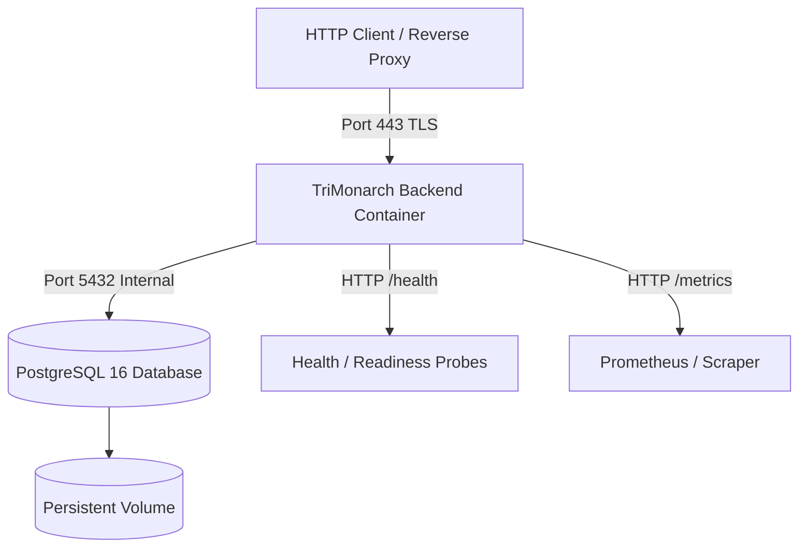

# TriMonarch ERP — Deployment Overview

## Overview

The TriMonarch ERP backend is deployed as a containerized, stateless Node.js service backed by a high-availability PostgreSQL 16 database.

---

## Deployment Architecture

---

## Key Deployment Lifecycles

1. **Startup Lifecycle**: Config validation (`src/config/env.ts` & `src/config/production.ts`) → Database health probe → Router binding → Health probe active.
2. **Health Check Lifecycle**: Liveness `/health/live` checks process status; Readiness `/health/ready` checks PostgreSQL connection.
3. **Migration Lifecycle**: Pre-deployment backup → Run `npm run db:migrate` → Verify schema → Deploy application container.
4. **Shutdown Lifecycle**: Receive `SIGTERM` → Stop accepting new connections → Drain pending requests → Close PG connection pool → Exit 0.
5. **Rollback Lifecycle**: Health check failure → Revert to previous image tag → Restore database snapshot if schema migration failed.
